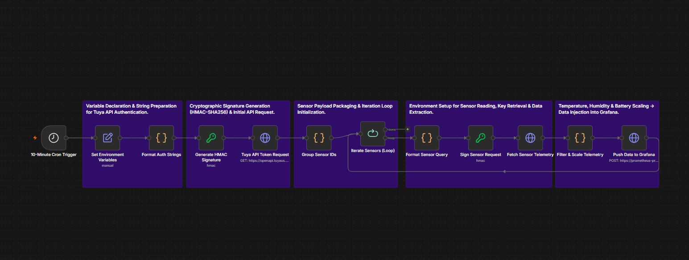
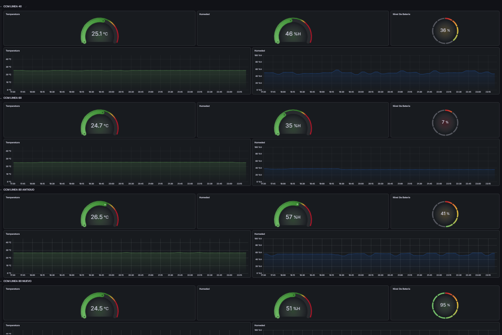

# IoT Predictive Thermal Monitoring Pipeline 🔥 📊

## Overview
An end-to-end automated IIoT (Industrial Internet of Things) pipeline that extracts real-time temperature and humidity telemetry from wireless sensors and visualizes it in a Grafana dashboard for predictive maintenance.

## ⚠️ The Business Problem
Reactive maintenance on critical Motor Control Centers (CCMs) often resulted in unexpected equipment downtime. We needed a way to detect hazardous temperature spikes before physical breakers tripped, but traditional PLC and SCADA integrations were prohibitively expensive and rigid.

## 🏗️ Solution Architecture
I designed a scalable orchestration architecture to completely bypass the need for proprietary hardware licenses:

1. **Hardware:** Deployed Wi-Fi-enabled Tuya sensors directly inside the electrical panels.
2. **Orchestration & ETL:** Engineered an **n8n** workflow to autonomously query the Tuya API every minute.
3. **Data Transformation:** The workflow extracts the JSON array, scales the raw variables, injects spatial tags, and structures the payload.
4. **Visualization:** Data is pushed to a time-series database and visualized on a **Grafana** dashboard with automated alert thresholds.

## 🧠 Technical Highlights & Decisions
* **Self-Healing API Authentication:** The Tuya API requires dynamic authentication. Instead of using static tokens that expire and break the pipeline, I engineered a logic loop that automatically generates cryptographic signatures (HMAC-SHA256) to fetch a fresh master access token before querying the sensors.
* **Fault Tolerance:** Built try/except error-handling branches to ensure 100% pipeline stability even during temporary API timeouts.

## ✅ Business Impact
* **Predictive Maintenance:** Eliminated reactive failures on 9 critical CCMs.
* **Cost Avoidance:** Achieved a secure, real-time IIoT integration with a **98% cost reduction** compared to traditional industrial monitoring systems.

## 🚀 How to Use This Repository
* **n8n Workflow:** The export file is located in [`workflows/tuya_telemetry_workflow.json`](workflows/tuya_telemetry_workflow.json). You can import this directly into your n8n instance to replicate the pipeline.
